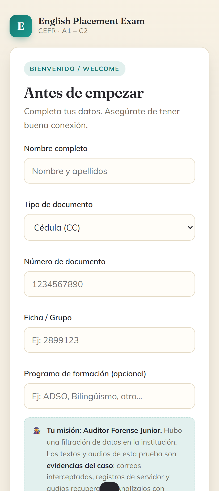
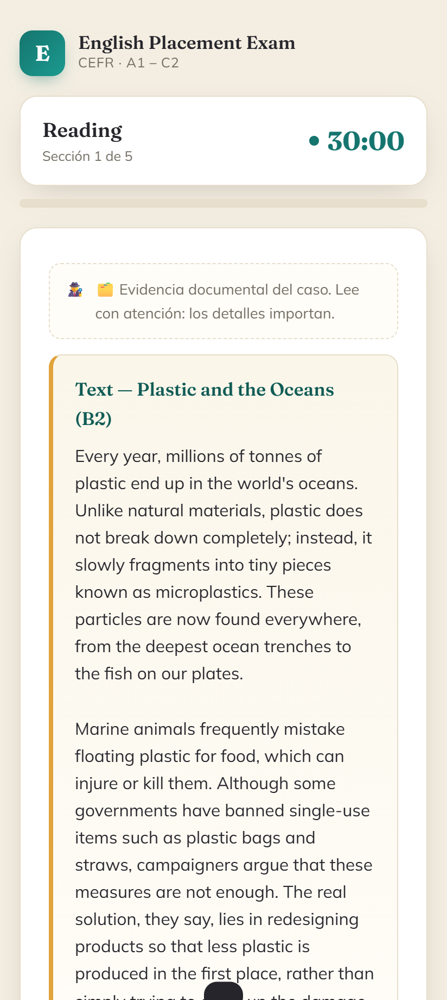
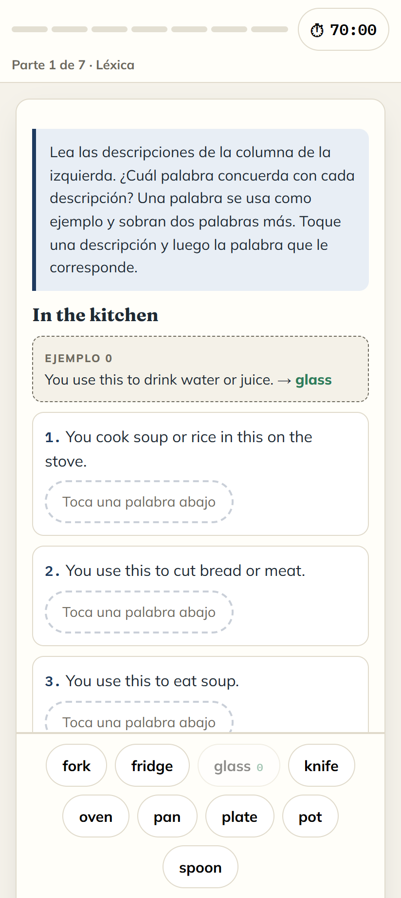
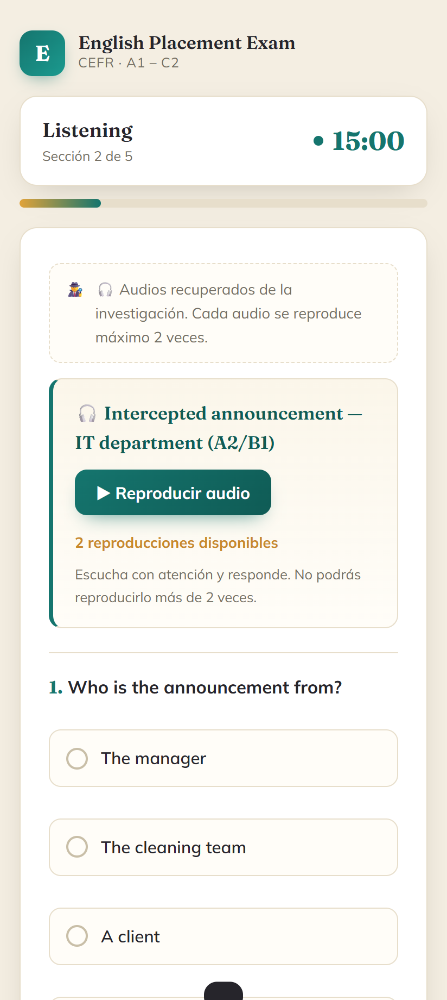
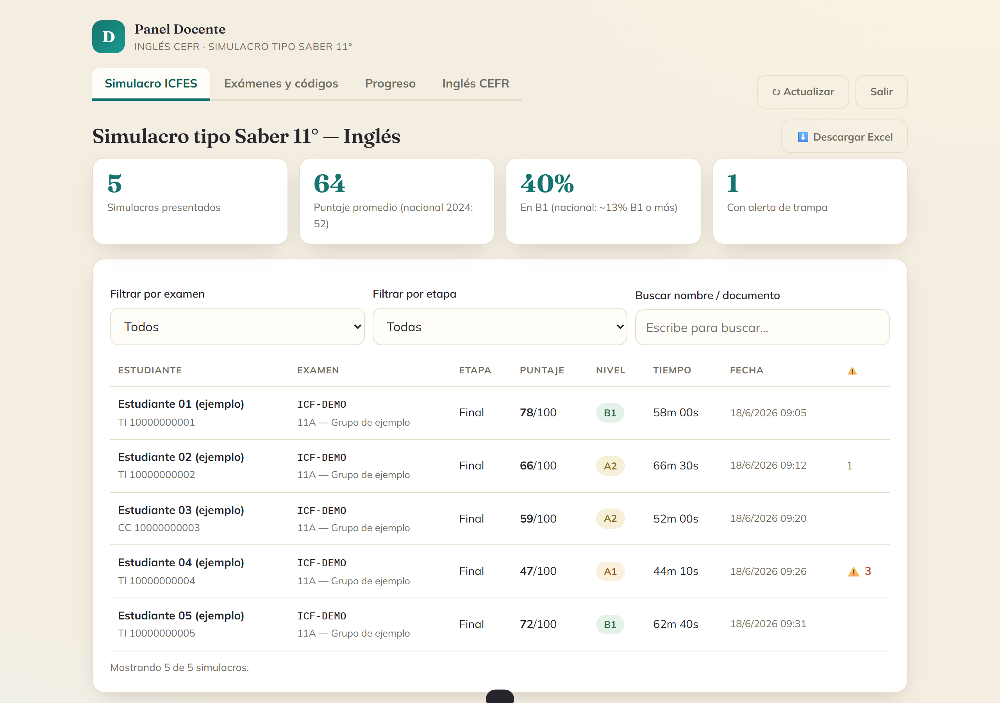
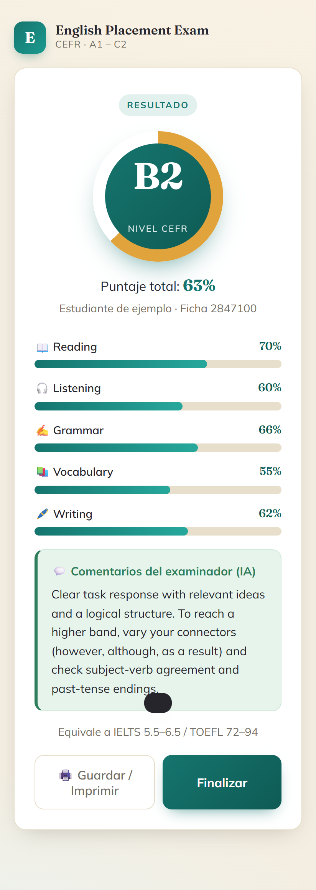

# SET — English Assessment Platform for Colombian Classrooms

> A web-based English assessment suite that gives public-sector teachers a **CEFR placement exam** and a **Saber 11–style English mock test**, grades open writing with AI, and turns the results into actionable, per-student and per-cohort insight.

**Status:** Working MVP — deployed and used in live assessment sessions. Actively iterated (see [Roadmap](#-project-status--roadmap)).
**Context:** Built for SENA / allied public schools in Colombia. The learner-facing UI is in Spanish (its users are Colombian students); this README is in English for portfolio review.

| | |
|---|---|
| **Type** | Educational assessment web app (learner + teacher facing) |
| **Role** | Learning Designer & Maker — assessment design, learning UX, and build |
| **Domain** | Language assessment (CEFR / A1–C2), Colombian Saber 11 English |
| **Stack** | Vanilla HTML/CSS/JS · Supabase (Postgres, Auth, Edge Functions/Deno) · OpenRouter (Kimi K2) · edge-tts · SheetJS · GitHub Pages |
| **Deploy** | 100% browser-based (no CLI required for the teacher to operate) |

---

## 🎯 The Educational Problem

English is a make-or-break subject for Colombian students, but the tools teachers have to *measure* it are weak:

- **The national reality is low.** On the English section of Saber 11 (the national high-school exit exam), reported results place the **large majority of students at A1 or below**, with a national average in the low 50s out of 100. Teachers need to see *where each student actually is* before they can move them.
- **Placement is guesswork.** Most classrooms sort students by intuition or a paper quiz that only tests grammar. There is no quick, consistent way to measure **all five skills** (Reading, Listening, Grammar, Vocabulary, Writing) and map a student to a CEFR band.
- **Writing never gets assessed at scale.** The one skill that reveals real proficiency — productive writing — is the first thing teachers drop, because grading 40 essays by hand is not sustainable.
- **"Practice tests" don't show growth.** A single mock score is a number, not a diagnosis. Teachers can't see whether a cohort *improved* between the start and end of a term, or *which* skills moved.
- **Tooling assumes resources most public teachers don't have.** No IT department, no budget for proctoring suites, no command-line comfort.

**SET addresses this** with two assessments a teacher can launch from a phone, automatic grading (including AI-graded writing), and a dashboard that reports growth across a term — all deployable and operable entirely from the browser.

---

## 🧩 What It Does

### 1. CEFR English Placement Exam (`index.html`)
A five-skill placement test that maps a student to a CEFR band (A1–C2).

- **Five sections:** Reading, Listening, Grammar, Vocabulary, Writing.
- **Weighted scoring** reflecting assessment priorities: Reading 25% · Listening 20% · Grammar 20% · Vocabulary 15% · Writing 20%.
- **Randomized item selection + shuffled options** per attempt, drawn from a question bank, so no two sittings are identical.
- **Authentic-format reading:** items are built around real-world artifacts — intercepted emails, server logs, chat threads — rendered in HTML/CSS, not just prose passages.
- **Light narrative framing** ("Junior Forensic Auditor") for engagement, layered *on top of* a standard CEFR measurement so the framing never distorts the score.

### 2. Saber 11–style English Mock Test (`icfes.html`)
An original mock built to the **official structure** of the Saber 11 English test.

- **7 parts, 55 questions**, following the real item counts and numbering (6/6/6/10/9/6/12) and the official convention of **Spanish instructions + a worked "0" example per part**.
- **Format-faithful item types:** description-to-word matching (tap-to-match, no drag-and-drop for mobile reliability), CSS-rendered public notices/signs, and cloze passages.
- **Current 4-band official scale:** Pre-A1 (0–36), A1 (37–57), A2 (58–70), B1 (71–100).
- **Honest scoring:** the 0–100 result is presented as an **estimate with a clear disclaimer** (the real exam uses IRT/TRI). Commercial naming is "Simulacro tipo Saber 11°" out of trademark respect.
- **Original items only** — authored in-house via an editorial pipeline (below); no copyrighted official items are reproduced.

### 3. Teacher Dashboard (`docente.html`)
The teacher's control room — no spreadsheets, no code.

- **Create an exam** with presets (e.g. 55- or 25-question forms) and generate a **human-friendly access code** that deliberately excludes confusable characters (no O/0, I/1, L).
- **Share instantly** via a large on-screen code, a **QR deep-link** that pre-loads the exam, or a one-tap **WhatsApp message**.
- **Live results** with KPIs benchmarked against the reported national average.
- **Growth view:** per-cohort deltas and an SVG "trail" sparkline per student across assessment stages.
- **Excel export** (SheetJS) with *Summary* and *Progress* sheets for record-keeping.

### 4. Audio / Listening
- **6 listening items** voiced with **neural TTS** (Microsoft edge-tts) — generated **free, no API key**, from scripts kept as the single source of truth.
- **Custom player capped at 2 plays** per audio (mirrors real testing conditions); extra attempts are logged as telemetry rather than blocked silently.

### 5. Results, Feedback & Reporting
- **AI-graded Writing.** Open essays are scored by **Kimi K2** (via OpenRouter) against a transparent **4-criterion rubric** (Task/Content, Coherence & Cohesion, Vocabulary, Grammar), and returned with actionable feedback — not just a number.
- **Comparative reports across stages.** When a student sits diagnostic → mid → final, the engine pulls prior results (linked by ID document) and produces an AI narrative report on what changed.
- **Student-facing results screen:** score, CEFR/level gauge, per-skill bars, and written feedback.

---

## 🏗️ How It Works (Architecture)

A deliberately **low-dependency, low-cost, browser-operable** design — chosen because the end user is a teacher with no dev tooling.

```
Student browser (index.html / icfes.html)
        │  sends only the marked options (never the answer key)
        ▼
Supabase Edge Function  (Deno / TypeScript)  ──►  OpenRouter → Kimi K2  (Writing + feedback)
        │  grades everything server-side, writes with service-role key
        ▼
Supabase Postgres  (Row-Level Security)  ◄──  Teacher dashboard (docente.html, Auth-gated)
```

**Assessment-integrity decisions baked into the architecture:**

- **The answer key never reaches the browser.** All grading — multiple-choice *and* writing — happens in the Edge Function. A student cannot see answers via DevTools. A secure build step (`build_secure.js`) strips answers from the client and injects the key into the server function.
- **Scores can't be forged.** Row-Level Security locks the anon role out of reading/writing the results table; only the Edge Function (service-role key) can insert.
- **One attempt per student**, keyed to the ID document, with server-side enforcement and a teacher "release attempt" path.
- **Autosave & resume** — a page reload never ejects a student mid-exam; the timer runs against a fixed deadline.
- **Identity confirmation across stages** so diagnostic/mid/final results link to the same student even if a digit is mistyped.
- **Anti-cheat telemetry** — tab-switching, paste events, and audio over-plays are recorded for the teacher.

**Item production pipeline** (how question quality is controlled):
> **Item writer → blind solver (verifies the key with no access to answers) → English-teacher review.**
> Anchor items are reserved for parallel forms (B/C) so growth between stages is comparable.

---

## 🎓 Learning Design Value

This project is, first, a **learning-design artifact** — the engineering exists to serve pedagogy.

- **Construct-aligned measurement.** Skills are weighted by assessment priority, mapped to published CEFR bands, and (for the mock) to the current official 4-band Saber 11 scale — not arbitrary cutoffs.
- **Assessment *for* learning, not just *of* learning.** The output is a diagnosis and a feedback report a student can act on, plus cohort analytics a teacher can plan from — designed around a diagnostic → intermediate → final growth loop.
- **Authenticity by design.** Reading and listening use real-world genres (emails, notices, logs, chats, spoken briefings) so the test measures *use of English*, not test-taking tricks.
- **Rubric transparency.** Writing is graded against a shared, human-readable rubric, so AI scoring is explainable and a teacher can override it.
- **Accessibility & equity of access.** Mobile-first, tap-based interactions (no drag-and-drop), confusable-free access codes, QR/WhatsApp distribution — meeting students and teachers on the devices they actually have.
- **Honest, ethical assessment.** Estimated scores carry disclaimers; minors' ID data is treated as personal data under Colombia's Ley 1581 with a consent notice; original items respect ICFES/IELTS/TOEFL trademarks and copyright.

---

## 👤 My Role

I designed and built SET end-to-end as a single-maintainer project, wearing three hats:

**Assessment Design**
- Defined the constructs, section weights, and CEFR band cut-offs for the placement exam.
- Reverse-engineered the official Saber 11 English structure (parts, item counts, scale, instruction language) and translated it into a faithful, original mock.
- Authored the **Writing rubric** and the item-quality pipeline (writer → blind solver → teacher review).
- Designed the **multi-stage measurement model** (diagnostic/mid/final with anchor items) so growth is comparable, not just re-tested.

**Educational UX**
- Designed the full learner journey — access code, consent, per-section instructions with worked examples, timers, autosave, results — for **low-friction use on student phones**.
- Made deliberate usability calls for the context: tap-to-match over drag-and-drop, confusable-free codes, QR/WhatsApp sharing, and a teacher dashboard that needs zero technical skill.
- Designed the results and feedback experience so a score is always paired with **what to do next**.

**Web Development & Systems**
- Built three single-file web apps (learner exam, mock test, teacher dashboard) and a Deno/TypeScript grading engine on Supabase.
- Implemented the assessment-integrity model (server-side grading, RLS lockdown, single-attempt, anti-cheat telemetry) and a **secure build step** that keeps answer keys out of the client.
- Integrated AI writing assessment (Kimi K2 via OpenRouter), free neural-TTS audio (edge-tts), Excel export (SheetJS), and QR generation — with a **100% browser-based deployment** flow the teacher can run alone.

> *Built with AI-assisted development workflows under my direction. I led the assessment design, learning architecture, UX decisions, product logic and validation process.*

---

## 📸 Screenshots

> Real screenshots captured at a phone-width view (the teacher dashboard on desktop), using **fictitious demo data only — no real student information is shown**. The live student exams require a teacher-issued code and write to a production database, so these captures are the best way to review the experience; a guided walkthrough can be provided on request.

**Home / start**


**CEFR placement exam**


**Saber 11–style mock test**


**Listening section**


**Teacher dashboard**


**Results & feedback**


---

## 🚦 Project Status & Roadmap

**This is a working MVP, honestly labeled as one** — deployed and used in real assessment sessions, not a finished commercial product.

**Done & in use**
- ✅ CEFR placement exam (5 skills) with AI-graded writing
- ✅ Saber 11–style mock (7 parts / 55 questions, official 4-band scale)
- ✅ Teacher dashboard: exam creation, access codes, QR/WhatsApp share, results, Excel export
- ✅ Server-side grading, RLS lockdown, single-attempt, autosave/resume, anti-cheat telemetry
- ✅ Neural-TTS listening, comparative AI feedback reports

**Planned / in progress (known gaps)**
- 🔜 **Parallel forms B/C with anchor items** (needed before the first real "intermediate" retest)
- 🔜 **Autosave/resume for the CEFR exam** (already shipped for the mock)
- 🔜 **Piloting & calibration** of item difficulty against real student data
- 🔜 **Critical Reading** mock (second Saber 11 area)
- 🔜 **Public API / microservice** to expose the grading engine to other apps
- 🔜 **Sellable material bank** (tagged item bank feeding practice, printable packs, and future international-style simulators)
- 🔜 Printable "class radiograph" report vs. national distribution

**Deliberately deferred**
- Remote proctoring (privacy/Ley 1581 + minors' data) and a generic multi-exam "engine" (avoiding premature over-engineering until demand is validated).

---

## 🛠️ Tech Stack

- **Frontend:** Vanilla HTML/CSS/JavaScript — three self-contained single-file apps, no framework, no build step for the client to run.
- **Backend:** Supabase — Postgres (with Row-Level Security), Auth (teacher login), Edge Functions (Deno/TypeScript) for all grading and inserts.
- **AI:** OpenRouter → **Kimi K2** (`moonshotai/kimi-k2`) for writing assessment and feedback reports.
- **Audio:** `edge-tts` neural voices (free, no API key), generated from Python scripts.
- **Libraries:** SheetJS (Excel), qrcodejs (QR codes), Supabase JS SDK.
- **Hosting:** GitHub Pages (learner + teacher apps). Deployment is fully browser-operable.
- **Security build:** a Node script separates answer keys from the client and injects them into the server function; validation suites guard every build.

> **Repository note:** this repo publishes only the learner/teacher apps and audio. Answer keys, source item banks, and the grading function's key live outside the public deployment by design.

---

## 📄 License & Use

Educational project. Original items and content © the author. "Saber 11" / "ICFES" are registered marks referenced descriptively; this is an independent *"Simulacro tipo Saber 11°"*, not an official product.
